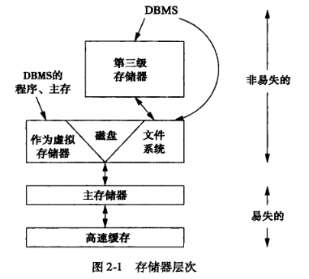

# 1. 回顾

1. 关系是元组的集合，元组是值的列表。
1. SQL查询的一般形式：

    ```sql
    select                  <属性表>
    from                    <关系表>
    where                   <条件>
    group by                <属性表>
    having                  <条件>
    order by                <属性表>
    ```

1. 子查询：SQL可在WHERE, HAVING, FROM中使用子查询。
1. 视图：是对于不实际存储但在需要时从实际存储的关系中所构造出来的描述。

# 2. 存储器层次

## 2.1 存储器层次图



