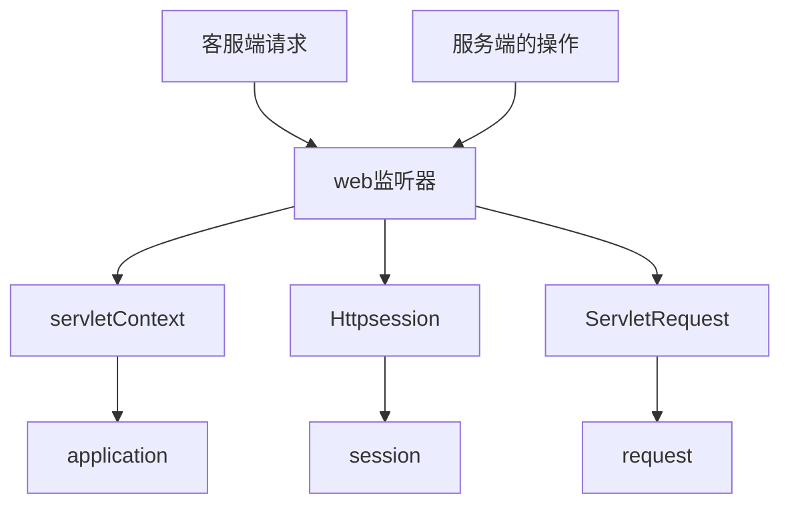

# java web开发技术应用--监听器
## 第一章 监听器简介
### 1.1.概述
**Servlet规范：**

    
**监听器的定义：**
* Servlet规范中定义的一种特殊类
* 用于监听ServletContext、HttpSession和ServletRequest等域对象的创建于销毁事件
* 用于监听域对象的属性发生修改的事件
* 可以在事件发生前、发生后做一些必要的处理

**监听流程：**

### 1.2.web监听器的用途
1. 统计在线人数和在线用户
2. 系统启动时加载初始化信息
3. 统计网站访问量
4. 跟spring结合

### 1.3.第一个web监听器
**步骤：**

1. 创建一个实现监听器接口的类
2. 配置web.xml进行注册

## 第二章 监听器的实现及启动顺序
### 2.1.第一个监听器案例
    public class FirstListener implements ServletContextListener {
        public void contextInitialized(ServletContextEvent servletContextEvent) {
            System.out.println("contextInitialized");
        }

        public void contextDestroyed(ServletContextEvent servletContextEvent) {
            System.out.println("contextDestroyed");
        }
    }
### 2.2.监听器的启动顺序
监听器>过滤器>Servlet

## 第三章 监听器的分类
**分类：**

按监听的对象划分：
1. 用于监听应用程序环境对象（ServletContext）的事件监听器
2. 用于监听用户会话对象（HttpSession）的事件监听器
3. 用于监听请求消息对象（ServletRequest）的事件监听器

 按监听的事件划分
1. 监听对象自身的创建和销毁的事件监听器
2. 监听域对象中的属性增加和删除的事件监听器
3. 监听绑定到HttpSession域中的某个对象的状态d呃事件监听器

### 3.1.ServletContext的事件监听器
    ServletContext-----> ServletContextListener
    1                  :                    n
    两个事件处理方法：
        contextInitialized方法
            public void contextInitialized(ServletContextEvent sce)
            ServletContext创建时调用
        contextDestroyed方法
            public void contextDestroyed(ServletContextEvent sce)
            ServletContext销毁时调用
        
### 3.2.HttpSession的事件监听器
    HttpSession         1
    HttpSessionListener n
    两个事件处理方法：
        sessionCreate方法
            public void sessionCreated(HttpSessionEvent se)
            session创建时调用
        sessionDestroyed方法
            public void sessionDestroyed(HttpSessionEvent se)
            session销毁时调用
    主要用途：
        统计在线人数
        记录访问日志

### 3.3.ServletRequest的事件监听器
    ServletRequest          1
    ServletRequestListener  n
    两个事件处理方法：
        requestInitialized方法
            public void requestInitialized(ServletRequestEvent sre)
            request创建时调用
        requestDestroyed方法
            public void requestDestroyed(ServletRequestEvent sre)
            request销毁时调用
    主要用途：
        读取参数
        记录访问历史

### 3.4.属性的增加和删除的事件监听器
    ServletContext:ServletContextAttributeListener
    HttpSession:HttpSessionAttributeListener
    ServletRequest:ServletRequestAttributeListener
    
### 3.4.绑定到HttpSession域中的对象状态的事件监听器
 #### 3.4.1 HttpSession中的对象状态

    绑定-->解除绑定
    钝化-->活化

 #### 3.4.2 Session钝化机制
    
    session--->服务器内存<-----序列化

 #### 3.4.3 Tomcat中方两种session钝化机制
**session钝化机制都sessionManager管理**

**org.apache.catalina.session.StandardManager**

    1. 当tomcat服务器被关闭或者重启是，tomcat服务器会被当前内存的session对象钝化到服务器文件系统中
    2. 另一种情况是web应用程序被重新加载时，内存中的session对象也会被钝化到服务器的文件系统中
    3. 钝化后的文件会被保存：tomcat安装路径：/work/Caralina/hostname/applicationname/SESSION.ser
---
**org.apache.catalina.session.Persiatenmanager**

    1. 首先在的钝化的基础上进行扩张。第一种情况如上面1，第二种情况如上 2，第三种情况，可以配置主流内存的session对象数目，将不长使用的session对象保存到文件系统或者数据库，当用到时在重新加载。
    2. 默认情况下，tomcat提供两个钝化驱动类
    3. org.apache.Catalina.FileStore和org.apache.Catalina.JDBCStore.

#### 3.4.4 Servlet规范：(不需要web.xml注册)

    HttpSessionBinDingListener
        绑定：valueBound方法
        解除绑定：valueUnbound方法
    HttpSessionActivationListener
        钝化：sessionWillPassivate方法
        活化：sessionDidActivate方法
    创建普通Javabean

## 第四章 Servlet 3.0下监听器的使用

## 第五章 项目案例
**实战练习：统计在线客户数量**

    创建一个listener，实现HttpSessionListener

## 第六章 监听器总结

    1. 监听器的概念
    2. 监听器的用途
    3. 第一个监听器的案例
    4. 监听器的启动顺序
    5. 监听器的分类
    6. 在servlet 3.0下的使用
    7. 监听器的实列